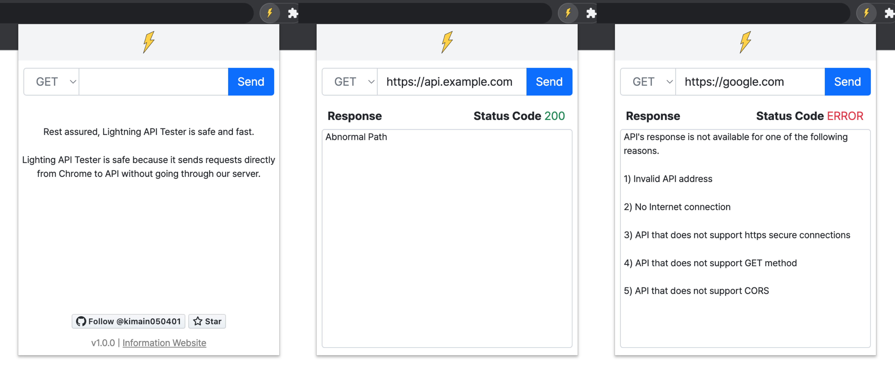

# Lightning API Tester

## Introduction
Test the API quickly using the Lightning API Tester.

## Preview

## License
Lightning API Tester is available under the `GNU General Public License v3.0`.  
See the [LICENSE](https://github.com/kimain050401/lightning-api-tester/blob/main/LICENSE) file for more info.

## Planned Updates
- [ ] API POST Request
- [ ] API Request History
